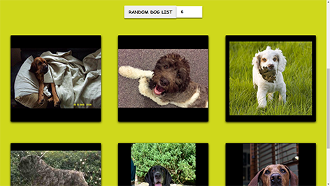

# Taller_API_GDG_Chimbote
Ejercicio del taller ¿Qué es una API?  ejemplo práctico con JavaScript

- [Prueba el resultado](https://felixgonzalo.github.io/Taller_API_GDG_Chimbote/)
- [Mira la grabación del taller](https://www.facebook.com/gdgchimbote/videos/1481509778889481)



## Tecnologías 🛠

- HTML
- CSS
- JavaScript

## Instalar proyecto 👀
Clonar el proyecto
```
  git clone https://github.com/FelixGonzalo/Taller_API_GDG_Chimbote
```
Ejecutar el archivo index.html con su navegador web favorito

## Redes sociales de GDG Chimbote ✌
* [GDG Chimbote](https://gdg.community.dev/gdg-chimbote/).
* [Youtube](https://www.youtube.com/channel/UC1piTFxLbea8glLqYTzlCLA).
* [Facebook](https://www.facebook.com/gdgchimbote).
* [Twitter](https://twitter.com/gdgchimbote/).
* [Instagram](https://www.instagram.com/gdgchimbote/).

## Mis redes sociales 😄
* [Youtube](https://www.youtube.com/c/FelixCastro003).
* [Facebook](https://www.facebook.com/felixcastro003).
* [LinkedIn](https://www.linkedin.com/in/felix-castro-cubas-633037192/).
* [Twitter](https://twitter.com/felixcastro003).
* [Instagram](https://www.instagram.com/felixcastro003/).
